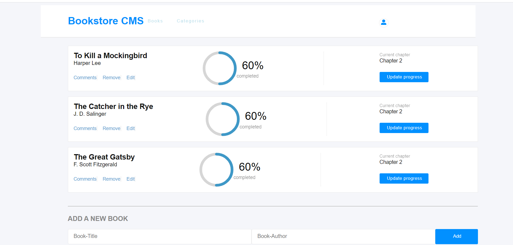

# Bookstore

> This is an educational project similar to the "Awesome Books" website. It is a MVP version of it that allows you to:
> - Display a list of books.
> - Add a book.
> - Remove a selected book.


## Built With

- [x] Languages: HTML, Sass and JavaScript
- [x] Linters: Stylelint and ESLint
- [x] Front-end library: React
- [x] Code Editor: VS Code


## Screenshot 📸
  

## Live Demo 🔗

Check the live demo [netlify](https://christabelle143-abb92a.netlify.app/)👈

## Getting Started

To get a local copy up and running follow these simple steps.

### Prerequisites

- [x] A web browser like Google Chrome.
- [x] A code editor like Visual Studio Code with Git and Node.js.

You can check if Git is installed by running the following command in the terminal.
```
$ git --version
```

Likewise for Node.js and npm for package installation.
```
$ node --version && npm --version
```

### Setup

Clone the repository using the GitHub link provided below.

### Install

In the terminal, go to your file directory and run this command.

```
$ git clone git@github.com:Christabelle143/bookstore.git

```

### Usage

Kindly modify the files as needed.

In the project directory, you can run:
```
$ npm start
```
Runs the app in the development mode.\
Open [http://localhost:3000](http://localhost:3000) to view it in your browser.

The page will reload when you make changes.\
You may also see any lint errors in the console.

### Run tests

To check for linters, use the files provided by [Microverse](https://github.com/microverseinc/linters-config). A GitHub action is also set to run during pull request.
```
$ npm install
```

### Deployment

This app is deployed in the using Netlify.
Please find the link in the Live Demo section.


## Author

👤 **Author**

- GitHub: [Christabelle143](https://github.com/Christabelle143)
- Twitter: [@christabelleyo](https://twitter.com/christabelleyo)
- LinkedIn: [YoutaChristabelle](https://linkedin.com/in/YoutaChristabelle)

## 🤝 Contributing

Contributions, issues, and feature requests are welcome!

Feel free to check the [issues page](https://github.com/Christabelle143/bookstore/issues).


## Show your support

Give a ⭐️ if you like this project!

## Acknowledgments

- [Microverse](https://www.microverse.org/)
- Code Reviewers
- Coding Partners

## 📝 License

This project is [MIT](./MIT.md) licensed.